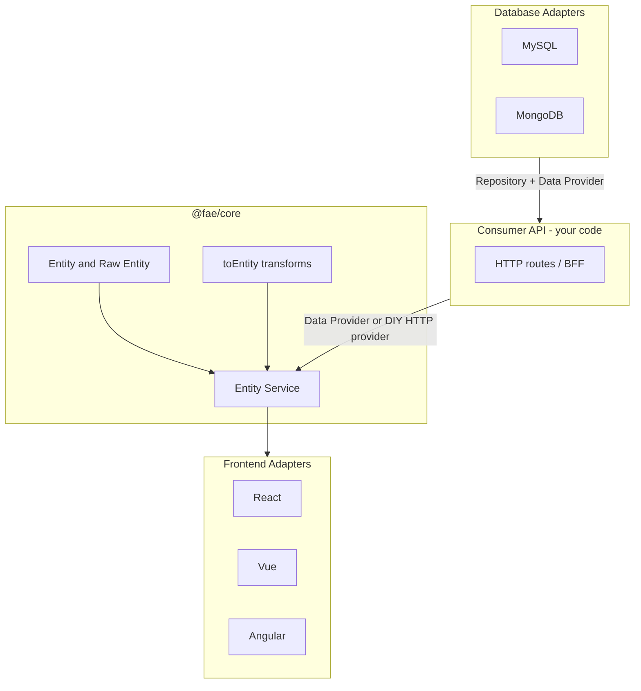

# Fullstack-Agnostic Data Ecosystem (FAE)

Publishable TypeScript monorepo SDK — shared data contracts and stack adapters.

Write Entity logic once in `@fae/core`; bridge it to React / Vue / Angular on the client and MySQL / MongoDB for persistence. Non-TypeScript backends align later via portable contracts (JSON Schema / OpenAPI), not first-class runtimes in the near term.


> Domain vocabulary: see [`CONTEXT.md`](./CONTEXT.md). Hard decisions: see [`docs/adr/`](./docs/adr/).

## Why FAE?

| Traditional approach | FAE approach |
| --- | --- |
| Rewrite fetch + state logic per framework | Implement once as an **Entity Service** in `@fae/core` |
| Duplicate DTO mapping in every app | Centralize **Raw Entity → Entity** transforms in core |
| Tight coupling to a single stack | Swap **Adapters** without changing business logic |
| Different DB access code per store | Shared **Raw Entity** + **Repository** / **Data Provider** contracts |

## Architecture



**Backend in the first milestone** means: use Database Adapters inside **your own API**. There is no separate `@fae/adapter-node` (or Java / Python / .NET) package yet.

## Packages

| Package | Status | Description |
| --- | --- | --- |
| `@fae/core` | ✅ Available | Entity Service, types, transforms, User example, `CoreDataService` facade |
| `@fae/adapter-mysql` | ✅ Available | MySQL `UserRepository` + `UserDataProvider` |
| `@fae/adapter-mongodb` | ✅ Available | MongoDB `UserRepository` + `UserDataProvider` |
| `@fae/react` | ✅ Available | `useFaeEntity`, `useUser`, `FaeProvider` |
| `@fae/vue` | ✅ Available | `useFaeEntity`, `useUser`, `FaeProvider` / plugin |
| `@fae/angular` | ✅ Available | `useFaeEntity`, `useUser`, `provideFae` |
| Portable contracts | 🚧 After milestone 1 | JSON Schema / OpenAPI for non-TypeScript stacks |
| Official HTTP adapter | ⏳ Later | DIY `Data Provider` for now |
| Backend runtime adapters | ⏳ Deferred | Node / Java / Python / .NET official packages |

## Quick start

```bash
git clone https://github.com/CHC-Hugo/Fullstack-agnostic-data-ecosystem.git
cd Fullstack-agnostic-data-ecosystem
npm install
npm run build
npm run typecheck
```

Copy `.env.example` to `.env` and adjust when using database adapters.

## Usage

### Entity Service (preferred)

Generic read + one-shot subscribe by id — the primary core API:

```typescript
import { createEntityService, createUserEntityService } from '@fae/core';

// Official User example
const users = createUserEntityService();
const user = await users.fetch('1');

const unsubscribe = users.subscribe('1', (state) => {
  // state: AsyncState<UserEntity> — loading | success | error
});

// Any custom Entity
const orders = createEntityService({
  provider: { fetchRaw: (id) => myApi.getOrderRaw(id) },
  toEntity: (raw) => ({ id: raw.id, total: raw.total_cents / 100 }),
});
```

`subscribe` is a **one-shot async load bridge** (loading → success | error), not a live cache or push feed. Lists / filters / writes stay on **Repository**.

### CoreDataService (compatibility facade)

Thin User-oriented wrapper kept for existing call sites. Prefer Entity Service for new code:

```typescript
import { CoreDataService } from '@fae/core';

const service = new CoreDataService();
const user = await service.fetchUser('1');
// same as service.user.fetch('1')
```

### Default mock provider

If you omit a Data Provider, core uses an in-memory **mock** User provider (Alice / Bob) so frontend adapters work zero-config. This is simulation — not production persistence.

### React adapter

```tsx
import { CoreDataService } from '@fae/core';
import { FaeProvider, useUser, useFaeEntity } from '@fae/react';

function UserProfile({ id }: { id: string }) {
  const { status, data, error } = useUser(id);

  if (status === 'loading') return <p>Loading…</p>;
  if (status === 'error') return <p>{error?.message}</p>;
  if (!data) return null;

  return (
    <div>
      <h1>{data.name}</h1>
      <p>{data.email}</p>
    </div>
  );
}

export function App() {
  return (
    <FaeProvider>
      <UserProfile id="1" />
    </FaeProvider>
  );
}

// Custom provider (e.g. MySQL / MongoDB Data Provider on the server, or DIY HTTP)
const service = new CoreDataService({ provider: myProvider });

export function AppWithCustomService() {
  return (
    <FaeProvider service={service}>
      <UserProfile id="1" />
    </FaeProvider>
  );
}
```

| Export | Description |
| --- | --- |
| `useFaeEntity(service, id)` | Generic bridge for any Entity Service |
| `useUser(id)` | User example over `useFaeEntity` |
| `FaeProvider` | Injects User-oriented `CoreDataService` (convenience entry) |
| `useFaeService()` | Read the provider service |

Custom Entities: pass an `EntityService` into `useFaeEntity` — the provider is not a multi-entity registry.

### Vue adapter

```ts
import { createApp } from 'vue';
import { createFaePlugin, useUser } from '@fae/vue';

const app = createApp(App);
app.use(createFaePlugin());
app.mount('#app');

// in a component setup():
const state = useUser('1');
```

Same semantics as React: `useFaeEntity`, `useUser`, provider/plugin. Names follow Vue conventions.

### Angular adapter

```ts
import { bootstrapApplication } from '@angular/platform-browser';
import { provideFae, useUser } from '@fae/angular';

bootstrapApplication(AppComponent, {
  providers: [provideFae()],
});

// in an injection context:
const state = useUser('1');
```

Same semantics: `useFaeEntity`, `useUser`, `provideFae` / `useFaeService`.

### MySQL adapter

Initialize schema (`packages/adapter-mysql/schema/mysql.sql`), then:

```typescript
import { CoreDataService } from '@fae/core';
import { createMysqlAdapter, mysqlConfigFromEnv } from '@fae/adapter-mysql';

const { provider, repository, disconnect } = createMysqlAdapter(mysqlConfigFromEnv());

const service = new CoreDataService({ provider });
const user = await service.fetchUser('1');

const all = await repository.findAll();

await disconnect();
```

| Variable | Default | Description |
| --- | --- | --- |
| `MYSQL_HOST` | `localhost` | MySQL host |
| `MYSQL_PORT` | `3306` | MySQL port |
| `MYSQL_USER` | `root` | MySQL user |
| `MYSQL_PASSWORD` | _(empty)_ | MySQL password |
| `MYSQL_DATABASE` | `fae` | Database name |
| `MYSQL_TABLE` | `users` | Users table name |

### MongoDB adapter

Documents store **Raw Entity** field names (`user_name`, `email_address`) so the boundary matches MySQL:

```typescript
import { createUserEntityService } from '@fae/core';
import { createMongodbAdapter, mongodbConfigFromEnv } from '@fae/adapter-mongodb';

const { provider, repository, disconnect } = createMongodbAdapter(mongodbConfigFromEnv());

const users = createUserEntityService({ provider });
const user = await users.fetch('1');

await disconnect();
```

| Variable | Default | Description |
| --- | --- | --- |
| `MONGODB_URI` | `mongodb://localhost:27017` | Connection URI |
| `MONGODB_DATABASE` | `fae` | Database name |
| `MONGODB_COLLECTION` | `users` | Collection name |

### Custom HTTP Data Provider

No official HTTP adapter package in the first milestone. Implement a Data Provider yourself:

```typescript
import { createUserEntityService, type UserDataProvider } from '@fae/core';

const httpProvider: UserDataProvider = {
  async fetchRawUser(id) {
    const res = await fetch(`/api/users/${id}`);
    if (!res.ok) throw new Error(`HTTP ${res.status}`);
    return res.json(); // must match UserEntityRaw
  },
};

const users = createUserEntityService({ provider: httpProvider });
```

Typical full-stack flow:

```text
Browser → DIY HTTP Data Provider → your API → Database Adapter → MySQL / MongoDB
```

## Core concepts

### Entity (camelCase — consumer contract)

```typescript
interface UserEntity {
  id: string;
  name: string;
  email: string;
}
```

### Raw Entity (snake_case — DB / transport contract)

```typescript
interface UserEntityRaw {
  id: string;
  user_name: string;
  email_address: string;
}
```

Core maps Raw Entity → Entity via `toUserEntity()` (or your `toEntity` for custom Entities).

### AsyncState\<T\>

Unified async state for all frontend adapters:

```typescript
type AsyncStatus = 'idle' | 'loading' | 'success' | 'error';

interface AsyncState<T> {
  status: AsyncStatus;
  data: T | null;
  error: CoreDataError | null;
}
```

### UserRepository (Database Adapters)

```typescript
interface UserRepository {
  findById(id: string): Promise<UserEntityRaw | null>;
  findAll(): Promise<UserEntityRaw[]>;
  create(data: UserEntityRaw): Promise<UserEntityRaw>;
  update(id: string, data: Partial<Pick<UserEntityRaw, 'user_name' | 'email_address'>>): Promise<UserEntityRaw | null>;
  delete(id: string): Promise<boolean>;
  disconnect(): Promise<void>;
}
```

## Project structure

```
fullstack-agnostic-data-ecosystem/
├── CONTEXT.md
├── docs/adr/
├── packages/
│   ├── core/                 # @fae/core
│   ├── adapter-mysql/        # @fae/adapter-mysql
│   ├── adapter-mongodb/      # @fae/adapter-mongodb
│   ├── react/                # @fae/react
│   ├── vue/                  # @fae/vue
│   └── angular/              # @fae/angular
├── .env.example
├── package.json
└── README.md
```

## Roadmap

### First publishable milestone

- [x] `@fae/core` — Entity Service, types, transforms, User example, mock provider
- [x] `@fae/react` / `@fae/vue` / `@fae/angular` — semantic parity
- [x] `@fae/adapter-mysql`
- [x] `@fae/adapter-mongodb`
- [x] README aligned with domain model (`CONTEXT.md` / ADRs)

### After milestone 1

- [ ] Portable contracts (JSON Schema / OpenAPI)
- [ ] Official HTTP adapter (optional convenience)
- [ ] Example Node API showing Database Adapter + routes
- [ ] Backend runtime adapters for other languages (deferred)

## Development

```bash
npm run build
npm run typecheck
npm test
```

Tests use **Vitest**. Add files as `packages/<pkg>/src/**/*.test.ts` and run them with root `npm test`. Prefer the agreed seams (Entity Service, UserRepository) — see AGENTS.md.

CI runs on every push/PR to `main` (typecheck + build + `npm test`).

## Contributing

Contributions welcome. Please open an issue before large changes so we can align on architecture. Prefer reading `CONTEXT.md` and `docs/adr/` first.

## License

MIT (coming soon)
