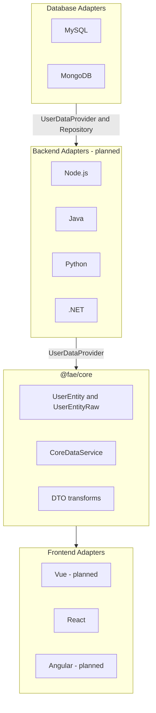

# Fullstack-Agnostic Data Ecosystem (FAE)

Cross-stack data contracts and adapters — a pure TypeScript core with frontend, backend, and database adapters.

Write your data logic once; bridge it to Vue, React, Angular on the client, Node.js / Java / Python / .NET on the server, and MySQL / MongoDB for persistence.


## Why FAE?

| Traditional approach | FAE approach |
| --- | --- |
| Rewrite fetch + state logic per framework | Implement once in `@fae/core` |
| Duplicate DTO mapping in every app | Centralize transforms in the core |
| Tight coupling to a single stack | Swap adapters without changing business logic |
| Different DB access code per ORM | Shared `UserEntityRaw` contract + DB adapters |

## Architecture



## Packages

| Package | Status | Description |
| --- | --- | --- |
| `@fae/core` | ✅ Available | Framework-agnostic data service, types, and transforms |
| `@fae/adapter-mysql` | 🚧 In progress | MySQL `UserRepository` + `UserDataProvider` |
| `@fae/adapter-mongodb` | 🚧 Planned | MongoDB adapter |
| `@fae/react` | ✅ Available | React hooks (`useUser`) + `FaeProvider` |
| `@fae/vue` | 🚧 Planned | Vue composables |
| `@fae/angular` | 🚧 Planned | Angular signals / services |
| Backend runtime adapters | 🚧 Planned | Node.js, Java, Python, .NET |

## Quick start

```bash
git clone https://github.com/JHJ-Hayes/Fullstack-agnostic-data-ecosystem.git
cd Fullstack-agnostic-data-ecosystem
npm install
npm run build
npm run typecheck
```

Copy `.env.example` to `.env` and adjust when using database adapters.

## Usage

### Promise API

For one-off requests or SSR:

```typescript
import { CoreDataService } from '@fae/core';

const service = new CoreDataService();

const user = await service.fetchUser('1');
// { id: '1', name: 'Alice Chen', email: 'alice@example.com' }
```

### Subscribe API

For reactive UI adapters (Vue ref, React Hook, Angular Signal):

```typescript
import { CoreDataService } from '@fae/core';

const service = new CoreDataService();

const unsubscribe = service.subscribeUser('1', (state) => {
  switch (state.status) {
    case 'loading':
      console.log('Loading…');
      break;
    case 'success':
      console.log(state.data); // UserEntity
      break;
    case 'error':
      console.log(state.error); // { code, message, cause? }
      break;
  }
});

// Later: unsubscribe();
```

### React adapter

Install React 18+ in your app, then:

```tsx
import { CoreDataService } from '@fae/core';
import { FaeProvider, useUser } from '@fae/react';

function UserProfile({ id }: { id: string }) {
  const { status, data, error } = useUser(id);

  if (status === 'loading') return <p>Loading…</p>;
  if (status === 'error') return <p>{error?.message}</p>;
  if (!data) return null;

  return (
    <div>
      <h1>{data.name}</h1>
      <p>{data.email}</p>
    </div>
  );
}

// Default: built-in mock provider
export function App() {
  return (
    <FaeProvider>
      <UserProfile id="1" />
    </FaeProvider>
  );
}

// Custom provider (e.g. HTTP or server-injected service)
const service = new CoreDataService({ provider: myProvider });

export function AppWithCustomService() {
  return (
    <FaeProvider service={service}>
      <UserProfile id="1" />
    </FaeProvider>
  );
}
```

| Export | Description |
| --- | --- |
| `useUser(id)` | Returns `AsyncState<UserEntity>` (`idle` / `loading` / `success` / `error`) |
| `FaeProvider` | Shares a `CoreDataService` instance via React context |
| `useFaeService()` | Read the service from the nearest `FaeProvider` |

### MySQL adapter

Initialize schema (`packages/adapter-mysql/schema/mysql.sql`), then:

```typescript
import { CoreDataService } from '@fae/core';
import { createMysqlAdapter, mysqlConfigFromEnv } from '@fae/adapter-mysql';

const { provider, repository, disconnect } = createMysqlAdapter(mysqlConfigFromEnv());

const service = new CoreDataService({ provider });
const user = await service.fetchUser('1');

// Full CRUD via repository
const all = await repository.findAll();

await disconnect();
```

Environment variables (see `.env.example`):

| Variable | Default | Description |
| --- | --- | --- |
| `MYSQL_HOST` | `localhost` | MySQL host |
| `MYSQL_PORT` | `3306` | MySQL port |
| `MYSQL_USER` | `root` | MySQL user |
| `MYSQL_PASSWORD` | _(empty)_ | MySQL password |
| `MYSQL_DATABASE` | `fae` | Database name |
| `MYSQL_TABLE` | `users` | Users table name |

### Custom HTTP provider

Replace the built-in mock with your own API client:

```typescript
import { CoreDataService, type UserDataProvider } from '@fae/core';

const httpProvider: UserDataProvider = {
  async fetchRawUser(id) {
    const res = await fetch(`/api/users/${id}`);
    if (!res.ok) throw new Error(`HTTP ${res.status}`);
    return res.json();
  },
};

const service = new CoreDataService({ provider: httpProvider });
```

## Core concepts

### `UserEntity` (camelCase — frontend contract)

```typescript
interface UserEntity {
  id: string;
  name: string;
  email: string;
}
```

### `UserEntityRaw` (snake_case — backend / DB DTO)

```typescript
interface UserEntityRaw {
  id: string;
  user_name: string;
  email_address: string;
}
```

The core maps `UserEntityRaw` → `UserEntity` via `toUserEntity()`.

### `AsyncState<T>`

Unified async state for all adapters:

```typescript
type AsyncStatus = 'idle' | 'loading' | 'success' | 'error';

interface AsyncState<T> {
  status: AsyncStatus;
  data: T | null;
  error: CoreDataError | null;
}
```

### `UserRepository` (MySQL — server-side CRUD)

```typescript
interface UserRepository {
  findById(id: string): Promise<UserEntityRaw | null>;
  findAll(): Promise<UserEntityRaw[]>;
  create(data: UserEntityRaw): Promise<UserEntityRaw>;
  update(id: string, data: Partial<Pick<UserEntityRaw, 'user_name' | 'email_address'>>): Promise<UserEntityRaw | null>;
  delete(id: string): Promise<boolean>;
  disconnect(): Promise<void>;
}
```

## Project structure

```
fullstack-agnostic-data-ecosystem/
├── .github/workflows/ci.yml
├── packages/
│   ├── core/                      # @fae/core
│   │   └── src/
│   │       ├── index.ts           # CoreDataService
│   │       ├── types.ts           # Shared contracts
│   │       └── utils/transform.ts
│   └── adapter-mysql/             # @fae/adapter-mysql
│       ├── schema/mysql.sql
│       └── src/...
│   └── react/                     # @fae/react
│       └── src/
│           ├── useUser.ts         # useUser hook
│           └── context.tsx        # FaeProvider
├── .env.example
├── package.json
└── README.md
```

## Roadmap

- [x] `@fae/core` — types, transforms, `CoreDataService`, mock provider
- [x] README & CI
- [x] `@fae/adapter-mysql` — schema, `UserRepository`, `UserDataProvider` (initial)
- [ ] `@fae/adapter-mongodb`
- [ ] Cross-language schema (JSON Schema / OpenAPI)
- [x] `@fae/react` — `useUser` hook + `FaeProvider`
- [ ] `@fae/vue`, `@fae/angular`
- [ ] Backend runtime adapters — Node.js, Java, Python, .NET

## Development

```bash
# Build all packages
npm run build

# Type-check all packages
npm run typecheck
```

CI runs on every push/PR to `main` (build + typecheck).

## Contributing

Contributions welcome. Please open an issue before large changes so we can align on architecture.

## License

MIT (coming soon)
